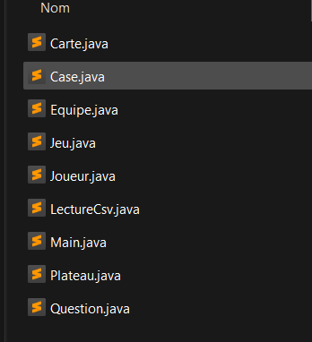

# 🎮 Projet TTMC — Tu Te Mets Combien ?

Projet réalisé dans le cadre du **BTS SIO — Jeu "Tu Te Mets Combien ?"** 
en version console, développé en Java.

---

## 📌 Présentation du jeu

TTMC est un jeu de culture générale où chaque joueur doit **s'auto-évaluer** 
avant de répondre à une question. Le joueur choisit combien de points il pense 
mériter, puis répond. Plus la mise est haute, plus les points gagnés (ou perdus) 
sont importants.

- 👥 Nombre de joueurs : [X joueurs]
- Ce joue en équipe
- 🎯 But : atteindre le score le plus élevé en fin de partie

---

## 🛠️ Technologies utilisées

| Technologie | Détail |
|---|---|
| Java | Language de programmation  |
| Mode | Console |
| IDE | IntelliJ |

---

## ✨ Fonctionnalités

- Choix du thème parmi plusieurs catégories : **Mature, Plaisir, Salaire, Improbable**
- Système de mise avant chaque réponse
- Calcul automatique du score
- Affichage du classement en fin de partie

---
## 🕹️ Lancement du jeu
Pour lancer le jeu :
- Télécharger les fichiers sur votre machine
- Lancer un IDE ( VS code, IntelliJ etc )
- Lancer en mode console pour y jouer
  
---

## Structure du projet

## 👥 Auteurs

- **Evan** — [@evanqlf](https://github.com/evanqlf)
- **Imane** - Partenaire de classe en BTS SIO

> Projet réalisé en groupe de 2 dans le cadre du BTS SIO — 2026
